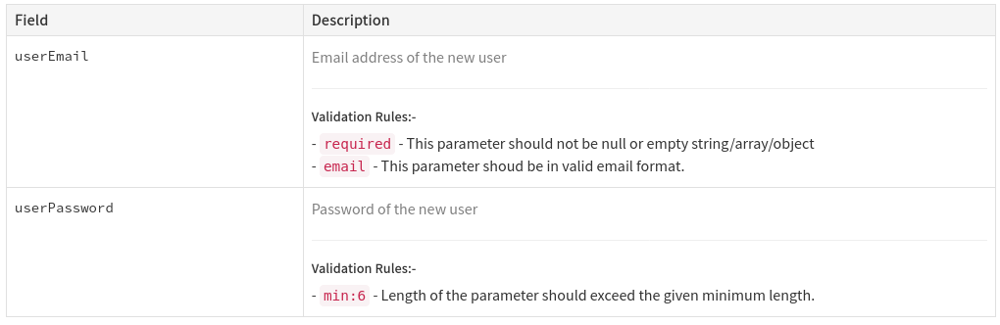

# api-doc-validation-plugin
Document request validation rules with `@apiValidator` and
`@apiValidate` annotations.

## Installation

```
npm install --save-dev apidoc-plugin-validation
```

No need to do extra works. Because this plugin name starts with
`apidoc-plugin-*` and apidoc will automatically loading the
plugins with this pattern.

## Usage

```js
/*
 * @apiValidator email Checking the given value is an email.
 */

/*
 * @apiValidate user.email email
 */

```

## Parse parameters to validation rules

```js

/*
 * @apiValidator min:{min} String length of the parameter should exceed
 * the given length
 */

/*
 * @apiValidate user.password min:8
 *
 */

```

## Preview



## Contribution

	All PRs and issues are welcome. And stars are also welcome.
